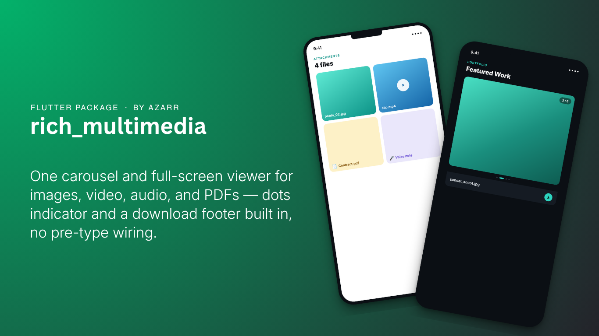
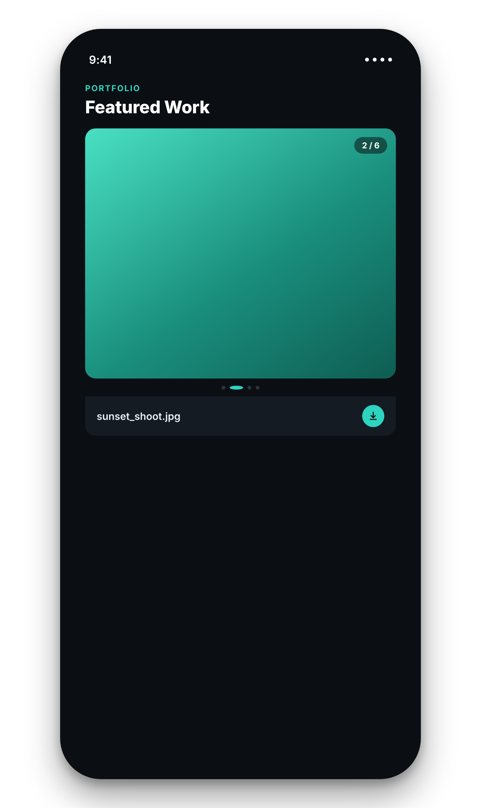
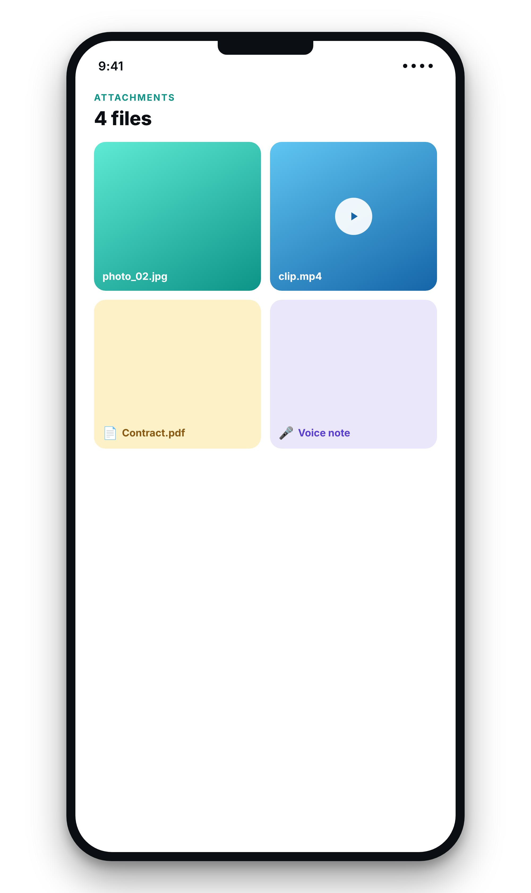

# rich_multimedia

<p align="center">
  
</p>

A model-agnostic Flutter kit for displaying mixed media — images, videos,
audio, and PDFs — in a carousel and a full-screen viewer, with optional
screenshot protection and a built-in download flow. Pass it a list of URLs
(or local file paths); it figures out what each one is and renders it.

<p align="center">
  
  &nbsp;&nbsp;
  
</p>

## Why

Most apps that let people attach or browse media (reviews, bookings,
portfolios, chat attachments) end up rebuilding the same four things:
something that tells an image apart from a video apart from a PDF, a
carousel to page through them, a full-screen viewer with pinch-to-zoom and
video controls, and a download flow. This package is those four things,
extracted and genericized so they're not tied to any one app's models.

## Install

```yaml
dependencies:
  rich_multimedia: ^0.1.0
```

## Quick start

The two widgets most apps need:

```dart
import 'package:rich_multimedia/rich_multimedia.dart';

// A single tappable media tile — taps open the full-screen viewer.
MultiMediaItem(
  url: attachment.url,
  mediaUrls: allAttachmentUrls, // optional: lets the viewer swipe through the rest
  index: attachment.index,
)

// A swipeable carousel with a footer (dots, counter, caption, download button).
MediaCarousel(
  mediaUrls: booking.proofOfWorkUrls,
  caption: booking.note,
  onDownload: (url) => MediaDownloader.download(context, url, galleryAlbum: 'My App'),
)
```

Both dispatch on file extension automatically — image, video, audio, pdf,
or a generic file placeholder for anything else (`MediaClassifier.classify`
is the single place that decision is made, used everywhere in this
package, so a file renders the same way in a carousel tile and the full
viewer).

## Opening the viewer directly

If you want your own tap target to open the full-screen viewer (rather
than using `MultiMediaItem`):

```dart
MediaFullViewer.show(
  context: context,
  mediaUrls: urls,
  initialIndex: tappedIndex,
  accentColor: Theme.of(context).colorScheme.primary,
);
```

## Gating downloads

`MediaCarousel`'s footer can show a locked, tooltip-explained placeholder
instead of the download button — useful for "not available until X"
flows (the original use case was a booking's proof-of-work photos, locked
until the vendor marks the job complete, but the concept is generic):

```dart
MediaCarousel(
  mediaUrls: urls,
  downloadLocked: !booking.isComplete,
  lockedTooltip: 'Available after the booking is marked complete',
  onDownload: (url) => MediaDownloader.download(context, url),
)
```

## Screenshot protection

`MultiMediaItem` and `MediaFullViewer` both turn on screenshot/screen-recording
protection (via the `no_screenshot` plugin) for as long as the viewer is
open, by default. Turn it off per call if your use case doesn't need it or
you'd rather not carry the extra native permission:

```dart
MultiMediaItem(url: url, protectFromScreenshots: false)
```

## Lower-level pieces

Every piece the two main widgets are built from is exported individually,
for a custom layout: `ImageItemWidget`, `VideoItemWidget`,
`VideoPreviewWidget`, `LocalVideoPreview`, `NetworkVideoPreview`,
`InMemoryAudioPlayer`, `InMemoryPdfViewer`, `FilePlaceholder`,
`MediaNavArrow`, `MediaDotsIndicator`, `MediaCarouselFooter`,
`ScreenshotProtection`, and the `MediaKind`/`MediaClassifier` pair
everything else dispatches on.

## Pairing with a reviews/list package

If you're also using a package like `reviews_ui_kit` to render a review
list, its `attachmentBuilder` callback is exactly the hook to wire up
`MultiMediaItem` for rendering each review's photos/videos — that hook
was added there specifically so this package's widgets could slot in
without `reviews_ui_kit` needing to depend on this one directly.

## What this package deliberately doesn't do

Picking *new* media to upload (an image/video/audio/document picker sheet,
a "remove before submitting" preview grid) is a different concern —
upload flows vary too much app to app to generalize well, and it's really
about picking files, not displaying existing ones. This package is
display/viewing only: give it URLs or local paths you already have, it
renders them.
